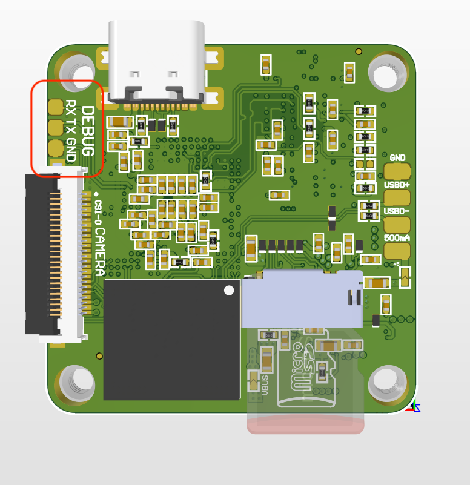
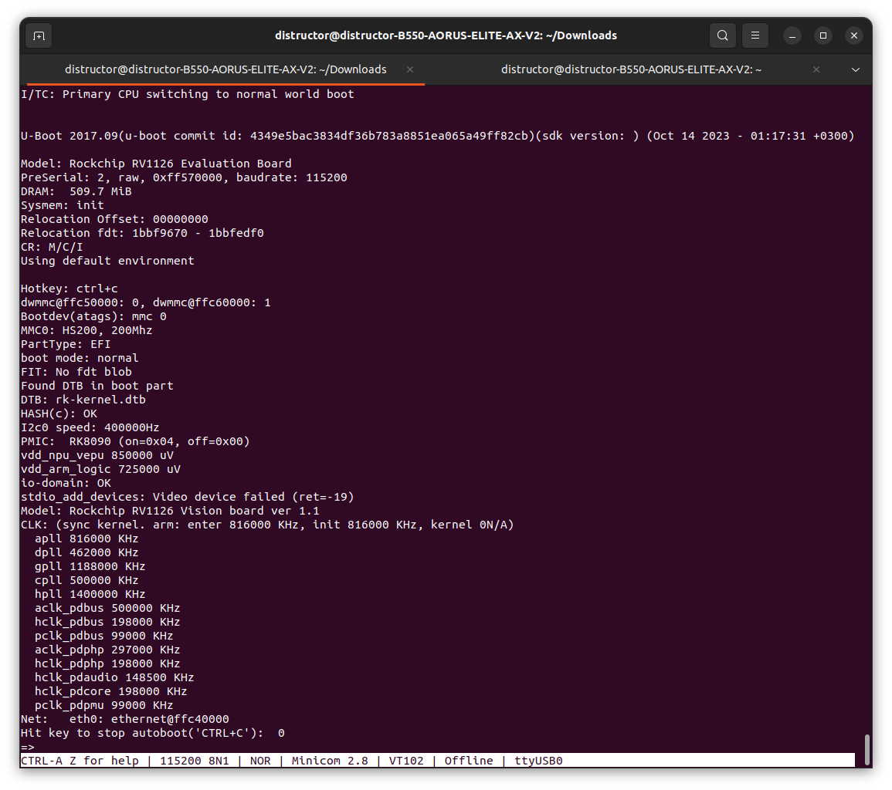
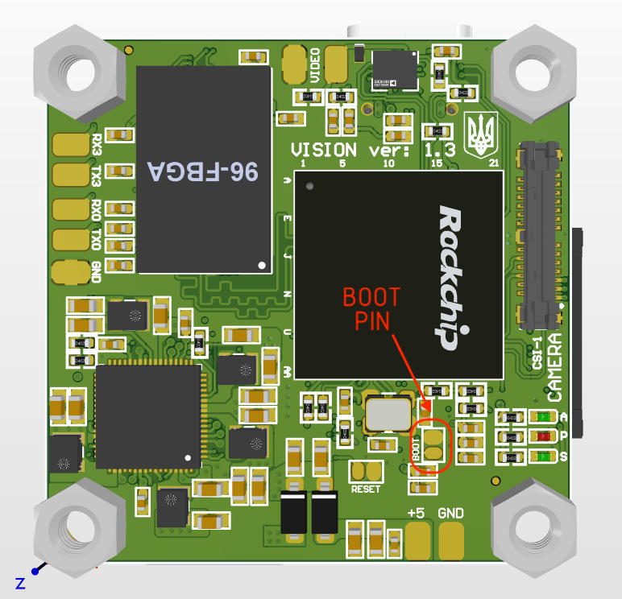

# vision-rv1126

# How to build 

#### Depends 

Install dependences<br>
**for ubuntu Ubuntu 20.04*
```shell
sudo apt-get install -y bison texinfo flex cmake libssl-dev liblz4-tool patchelf chrpath gawk expect-dev python2 python git git-lfs expect-dev debianutils sed make binutils build-essential gcc g++ bash patch gzip bzip2 perl tar cpio unzip rsync file bc git device-tree-compiler
```

Clone project  
```shell
git clone git@gitlab.hard-tech.org.ua:vision/vision-rv1126-buildroot.git
cd vision-rv1126
```

Load and prepare environment for build
```shell
./build.sh device/rockchip/rv1126_rv1109/vision-rv1126.mk
```


Execute the following command in the root directory: `./build.sh -h|help`
```shell
./build.sh help
Usage: build.sh [OPTIONS]
Available options:
BoardConfig*.mk -switch to specified board config
lunch           -list current SDK boards and switch to specified board config
uboot           -build uboot
spl             -build spl
loader          -build loader
kernel          -build kernel
modules         -build kernel modules
toolchain       -build toolchain
rootfs          -build default rootfs, currently build buildroot as default
buildroot       -build buildroot rootfs
ramboot         -build ramboot image
multi-npu_boot  -build boot image for multi-npu board
yocto           -build yocto rootfs
debian          -build debian9 stretch rootfs
distro          -build debian10 buster rootfs
pcba            -build pcba
recovery        -build recovery
all             -build uboot, kernel, rootfs, recovery image
cleanall        -clean uboot, kernel, rootfs, recovery
firmware        -pack all the image we need to boot up system
updateimg       -pack update image
otapackage      -pack ab update otapackage image
save            -save images, patches, commands used to debug
allsave         -build all & firmware & updateimg & save
Default option is 'allsave'.
```

Manual build U-boot
```shell
./build.sh uboot
```

Manual build Kernel 
```shell
./build.sh kernel
```

Manual build rootfs 
```shell
./build.sh rootfs
```

Manual build recovery  
```shell
./build.sh recovery
```

Firmware packaging command: `./mkfirmware.sh`
Firmware stored in directory: `rockdev`


### Instructions to U-Boot Config
```shell
### use menuconfig to configure U-Boot, select config, save and exit.
### rv1126_defconfig can be found in the directory of u-boot/configs
### command format: make "RK_UBOOT_DEFCONFIG"_defconfig
### RK_UBOOT_DEFCONFIG define in the BoardConfig*.mk file which ./build.sh select
cd u-boot
make rv1126_defconfig
make menuconfig

### save config to rv1126_defconfig
make savedefconfig
cp defconfig configs/rv1126_defconfig
```

### Instructions to Kernel Config

```shell
### to view detailed Kernel build command
./build.sh -h kernel

### use menuconfig to configure Kernel, select config, save and exit.
cd kernel
make ARCH=arm rv1126_vision_defconfig
make ARCH=arm menuconfig

### save config to rv1126_vision_defconfig
make ARCH=arm savedefconf
cp defconfig arch/arm/configs/rv1126_vision_defconfig

### Kernel building command
make ARCH=arm rv1126-vision-board2 -j24
```

### Instructions to Rootfs Config

```shell
### 1. In the root directory SDK, get the rootfs configure of the board config.
./build.sh -h rootfs

# ### Current SDK Default [ rootfs ] Build Command###
# source envsetup.sh rockchip_rv1126_rv1109_vision
# make
### 2. source the defconfig of buildroot
source envsetup.sh rockchip_rv1126_rv1109_vision

### 3. use menuconfig to configure Rootfs, select config, save and exit.
### e.g. ipc-daemon's config
### a. find the config file for app/ipc-daemon
### grep -lr "app/ipc-daemon" buildroot/package
### buildroot/package/rockchip/ipc-daemon/ipc-daemon.mk
### Corresponding configuration file: buildroot/package/rockchip/ipcdaemon/Config.in

###
### b. Get configuration name: BR2_PACKAGE_IPC_DAEMON
### see: buildroot/package/rockchip/ipc-daemon/Config.in
make menuconfig # enter menuconfig, input “/" and goto search mode, input BR2_PACKAGE_IPC_DAEMON

### 4. save to rootfs config file
### ./buildroot/configs/rockchip_rv1126_rv1109_vision_defconfig
make savedefconfig
```

### Instructions to Recovery config
```shell
### 1. Get the recovery configure of the board config.
./build.sh -h recovery

# ###Current SDK Default [ recovery ] Build Command###
# source envsetup.sh rockchip_rv1126_rv1109_vision_recovery
# device/rockchip/common/mk-ramdisk.sh recovery.img

### 2. source the defconfig of buildroot
source envsetup.sh rockchip_rv1126_rv1109_vision_recovery

### 3. use menuconfig to configure Recovery, select config, save and exit.
### e.g. disable recovery ui config is BR2_PACKAGE_RECOVERY_NO_UI (see buildroot/package/rockchip/recovery/Config.in)
### make menuconfig # enter menuconfig, input “/" and goto search mode, input
### BR2_PACKAGE_RECOVERY_NO_UI
### 4. save to recovery config file
### ./buildroot/configs/rockchip_rv1126_rv1109_vision_recovery_defconfig
make savedefconfig
```


# How to flash

`upgrade_tool` stored in folder `tools/linux/Linux_Upgrade_Tool/Linux_Upgrade_Tool/upgrade_tool`

```shell
### In addition to MiniLoader All.bin and parameter.txt, the actual partition to
be burned is based on rockdev / parameter.txt configuration.
sudo ./upgrade_tool ul rockdev/MiniLoaderAll.bin
sudo ./upgrade_tool di -p rockdev/parameter.txt
sudo ./upgrade_tool di -u rockdev/uboot.img
sudo ./upgrade_tool di -misc rockdev/misc.img
sudo ./upgrade_tool di -b rockdev/boot.img
sudo ./upgrade_tool di -recovery rockdev/recovery.img
sudo ./upgrade_tool di -oem rockdev/oem.img
sudo ./upgrade_tool di -rootfs rocdev/rootfs.img
sudo ./upgrade_tool di -userdata rockdev/userdata.img
sudo ./upgrade_tool rd
```

Second method - use [rkdeveloptool](https://github.com/rockchip-linux/rkdeveloptool)https://github.com/rockchip-linux/rkdeveloptool


## Flashing over UBOOT
For flashing new firmware to device using uboot make shure that you have connected debug UART interface

Solder 3 wires to debug UART



Connect to UART device via any available terminal for instance monicom
```shell
# Need to solder uart debug wires 
sudo minicom -D /dev/ttyUSBx
```
Quickly press CTRL+C while the device reboots until the uboot terminal appears


```shell
# Activate usb device as bridge to write new buildroot to mmc
rockusb 0 mmc 0
```

Upgrade the whole update.img firmware after packaging:

```shell
sudo ./upgrade_tool uf rockdev/update.img
```
Or in root directory, run the following command on your device to upgrade in MASKROM state:

```shell
sudo ./rkflash.sh
```

## Flashing over boot button

Press boot button or short off the two pads like on the picture



Run upgrade utility

Upgrade the whole update.img firmware after packaging:

```shell
sudo ./upgrade_tool uf rockdev/update.img
```

After successfully start of upgrading release the button
